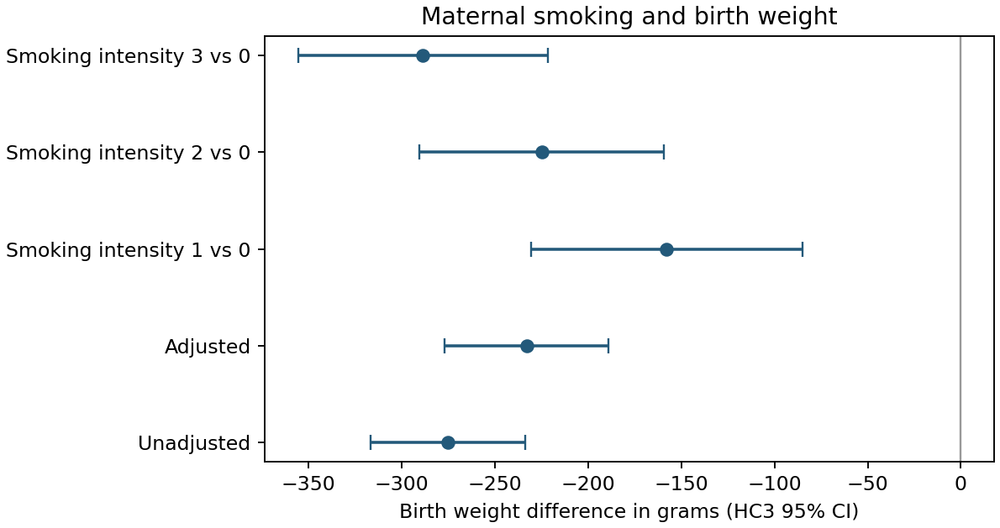

# Maternal Smoking and Birth Weight

Compare unadjusted and adjusted birth weight differences, with explicit confounding limits and consistent analysis cohorts.

**Author:** Heyang Ma · Independent UCLA graduate course project, revised for this portfolio.
**Tools:** Python / statsmodels, Regression adjustment, Robust uncertainty. **Scope:** 4,642 observations.

## Question

How does the association between maternal smoking and birth weight change after measured covariate adjustment?

## What I did

I fit unadjusted and covariate-adjusted linear regressions on a common complete-case cohort and used HC3 confidence intervals to compare the smoking association before and after adjustment.

## Main finding

The unadjusted difference was −275 g (HC3 95% CI −317 to −234). Adjusting for maternal age, race, education, marital status, and alcohol use gave −233 g (−277 to −189). Both fits use the same 4,642 observations.



_Unadjusted and adjusted birth-weight associations with HC3 95% confidence intervals._

## Important limitations

This is observational evidence. Adjustment does not eliminate unmeasured confounding, exposure misclassification, or selection bias. Intensity categories are treated as categorical; the analysis does not claim a causal dose-response relationship. No formal sensitivity analysis was performed.

## Code and reproducibility

Install Python dependencies with `python -m pip install -r requirements.txt`.
Read [data access and input requirements](DATA_ACCESS.md), then run from this repository:

```sh
python analysis.py --data data/bweight.csv --output results
```


The executable analysis is [analysis.py](analysis.py). See [REPORT.md](REPORT.md) for model details and interpretation, [DATA_ACCESS.md](DATA_ACCESS.md) for inputs, and [REVISION_NOTES.md](REVISION_NOTES.md) for the distinction between the course project and portfolio revision. The committed `results/` files are generated summaries from the revision.

## Checks

Run `python -m unittest test_analysis.py`. These tests cover the corrected failure cases; they do not replace statistical validation.
